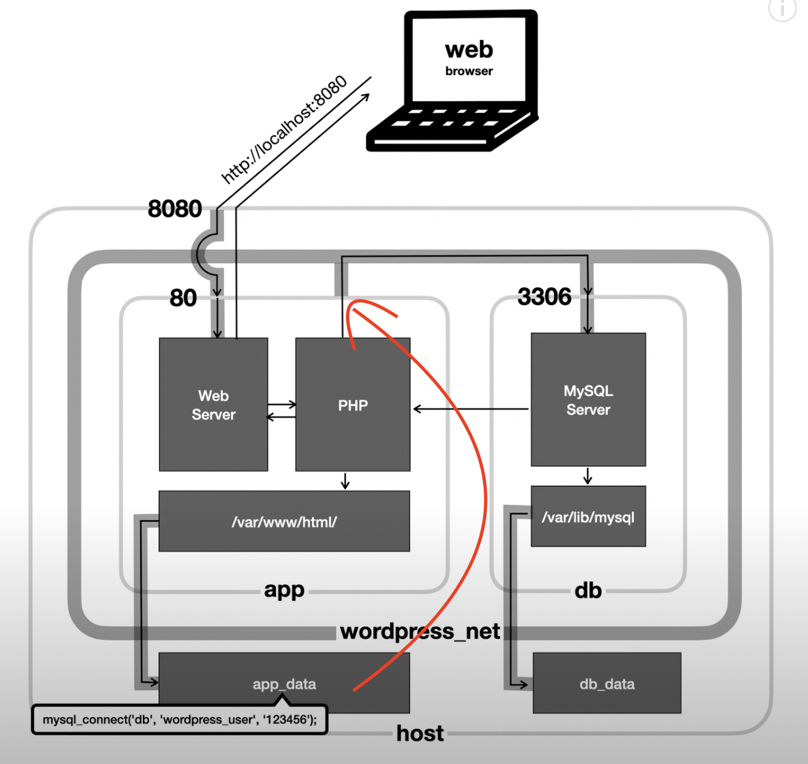

# Docker Compose를 이용해서 복잡한 도커 컨테이너를 제어하기

## docker-compose.yml 로 명령어 관리

### docker cli 명령어

```
$ docker run --name "db"
  -v "$(pwd)/db_data:/var/lib/mysql"
  -e "MYSQL_ROOT_PASSWORD=123456"
  -e "MYSQL_DATABASE=wordpress"
  -e "MYSQL_PASSWORD=123456"
  --network wordpress_net mysql:5.7
```

### 위와 똑같은 docker-compose.yml 파일

```yml
version: "3.7"
service:
  db:
    image: mysql:5.7
    volumes:
      - ./db_data:/var/lib/mysql
    restart: always
    environment:
      MYSQL_ROOT_PASSWORD: 123456
      MYSQL_DATABASE: wordpress
      MYSQL_USER: wordpress_user
      MYSQL_PASSWORD: 123456
```

- docker-compose up
  - 컨테이너 만들어진다면? It would be awesome!

## 수업 시나리오

- Wordpress : 설치형 블로그

  - 도커 이미지를 이용해서 컨테이너로 만들어서 실행

- MySQL 컨테이너도 필요
- 시나리오

  - Web browser <-> Wordpress <-> MySQL

- 실습 참고 파일

  - https://gist.github.com/egoing/b62aa16573dd5c7c5da51fd429a5faa2
  - command : 명령어
  - docker-compose.yml : 도커에서 사용할 설정 파일
    - 커맨드와 똑같은 일을 함

- wordpress dotnet network 생성

  - `docker network create wordpress_net`

## 명령어로 설정하기

#### DB, MySQL 이미지를 기반으로 컨테이너를 만드는 명령어

```sh
docker \
run \
    --name "db" \
    -v "$(pwd)/db_data:/var/lib/mysql" \
    -e "MYSQL_ROOT_PASSWORD=123456" \
    -e "MYSQL_DATABASE=wordpress" \
    -e "MYSQL_USER=wordpress_user" \
    -e "MYSQL_PASSWORD=123456" \
    --network wordpress_net \
    --platform linux/amd64 \
mysql:5.7
```

#### Wordpress를 실행하는 명령어

```sh
docker \
    run \
    --name app \
    -v "$(pwd)/app_data:/var/www/html" \
    -e "WORDPRESS_DB_HOST=db" \
    -e "WORDPRESS_DB_USER=wordpress_user" \
    -e "WORDPRESS_DB_NAME=wordpress" \
    -e "WORDPRESS_DB_PASSWORD=123456" \
    -e "WORDPRESS_DEBUG=1" \
    -p 8080:80 \
    --network wordpress_net \
wordpress:latest
```

- 두 컨테이너는 wordpress_net이라는 네트워크로 연결된 상태가 됨

## 도커 컴포즈 파일로 설정하기

- 기존에 실행했던 것들을 삭제
- docker rm --force app
- docker rm --force db
- docker network rm wordpress_net

#### docker-compose 설정

```yml
version: "3.7" # 버전

services: # 컨테이너들
  db: # 컨테이너 이름
    image: mysql:5.7 # mysql5.7 이미지를 사용해라
    volumes: # HOST에 폴더를 만들고 컨테이너와 연결
      - ./db_data:/var/lib/mysql
    restart: always
    environment: # 환경 변수
      MYSQL_ROOT_PASSWORD: 123456
      MYSQL_DATABASE: wordpress
      MYSQL_USER: wordpress_user
      MYSQL_PASSWORD: 123456

  app:
    depends_on: # mysql을 이용하기 때문에 mysql서버가 먼저 만들어져야 함
      - db # db 컨테이너가 먼저 만들어지고 그 다음 wordpress 컨테이너가 만들어짐
    image: wordpress:latest
    volumes:
      - ./app_data:/var/www/html
    ports: # app만 포트를 열어 둠
      - "8080:80"
    restart: always
    environment:
      WORDPRESS_DB_HOST: db:3306 # ip가 아닌 컨테이너 이름만으로 접속가능하게 하려면 네트워크를 만들어야 함
      WORDPRESS_DB_NAME: wordpress
      WORDPRESS_DB_USER: wordpress_user
      WORDPRESS_DB_PASSWORD: 123456
```

- 실행 : docker-compose up

- 종료 : docker-compose down

- app만 접속 가능하게 하고 db컨테이너는 접속이 불가능하게 설정

- wordpress에서 ip가 아닌 컨테이너 이름으로 접근하도록 하기 위해 네트워크를 만들음
  - 명령어 : `docker network create wordpress_net`
  - 도커 컴포즈 : 컴포즈를 만드는 순간 자동으로 네트워크가 만들어지고 앱들은 그 네트워크에 자동으로 연결이 됨

## flow


